我**不推荐使用太微空白版本**，如果有能力自己从空白版本配置，那大概率也不需要本文档。

## TiddlyWiki XP

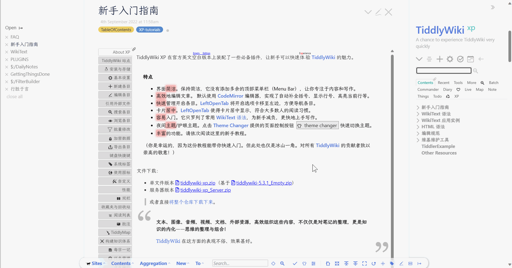

- [TiddlyWiki XP](https://keatonlao.github.io/tiddlywiki-xp/)

上面两张图片是 TiddlyWiki XP 网站的封面图，可以看到 TiddlyWiki XP 不止是发行版本，同时也是一份极好地教程。所以我在首页也特地放上了 TiddlyWiki XP 的访问链接，上面也可以看到。这里我把教程和发行版本都放到资料群里，方便下载查看。

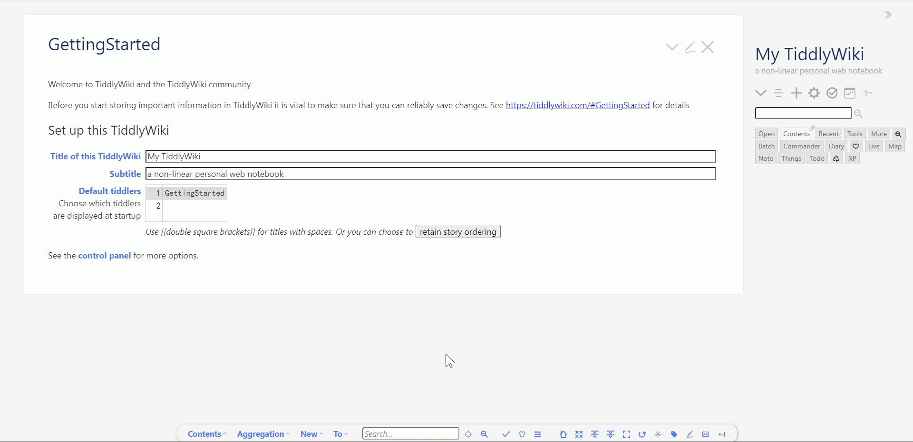

解压 `tiddlywiki-xp.zip`文件夹后，发现里面有两个 html 文件，一个是 `tiddlywiki-xp_Full.html`，另一个是 `tiddlywiki-xp_Minimal.html`。前者是 TiddlyWiki XP 的完整发行版本，包含 90 个插件，后者是 TiddlyWiki XP 简约版本，但也足够用户使用，可按需求下载。

### 基本保存与语言设置

但如图所示，封面上全是英文，所以我们需要把语言设置调整为中文。这里 TiddlyWiki XP 已经安装了语言插件，就不演示如何安装，后面会写如何安装插件。下面图片中展示了如何调整语言设置的过程。

首先点击侧边栏里的设置按钮，在展示出来的 `$:/ControlPanel`条目中找到当前语言。然后点击选择，选择简体中文即可。再点击侧边栏中，标红的按钮，点击保存。这样你就得到了修改后的 TiddlyWiki XP 了，并且也学会了**最基本的保存方式**，修改 HTML 文件并点击按钮保存。这里选择后就自动展示为中文了。

## TiddlyDesktop

但如果我们每次都这样，修改后点击保存，是不是太繁琐呢？所以我们现在需要一个桌面启动器，然后帮助我们快速打开并保存备份。

[TiddlyDesktop](https://github.com/TiddlyWiki/TiddlyDesktop) 是由官方开发的桌面启动器。支持所有的桌面平台，是安全绿色的软件。下载地址可以去上面的 github 仓库中，点击 release 下载。这里我也把桌面启动器下载文件放到资料群里。

这里我使用的是 `win11`电脑系统，其他系统不了解。理论上安装不会受影响。这里只演示 windows11 下的操作。我选择的是 `tiddlydesktop-win64-v0.0.18.zip`，解压文件夹，然后双击里面的 `nw.js`，如下图所示。

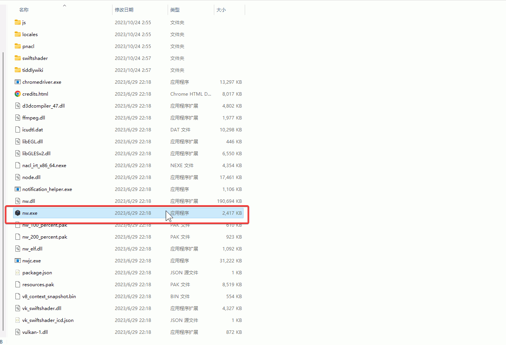

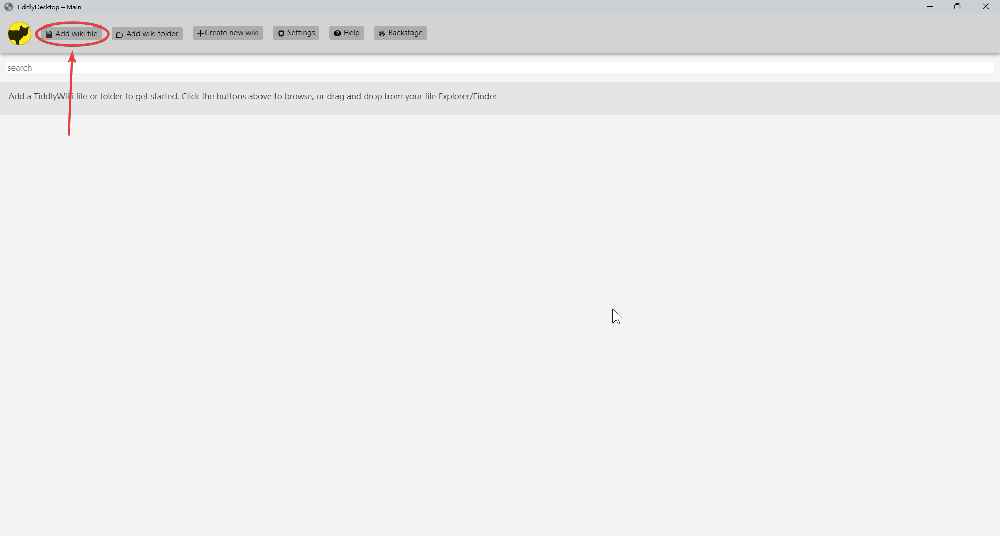

然后就会打开如上图那样的界面。点击上面的 add wiki file，然后添加之前保存的 tiddlywiki-xp_Full.html 文件夹路径。如下图所示。

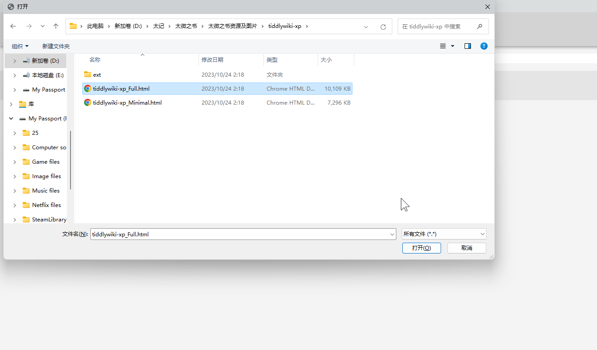

接着点击确认打开。

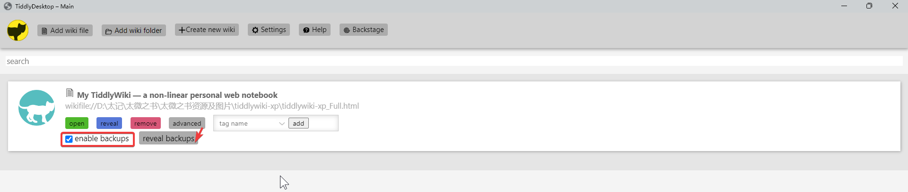

然后就可以看到有四个按钮。分别是 open、
reveal、remove、和 advanced，分别表示，打开、展示备份、删除和高级。高级选项里可以勾选是否备份文件夹，默认是备份的。

如果备份的话，需要定时去清理一下文件夹，点击 reveal 就可以打开了。不定时清理的话，可能会有好几 G 的备份文件。因为一次备份就 10m，一百次备份大概就有 1G 了。

打开编辑操作会在下一节里讲述，这里也可以自行探索一下。

TiddlyDesktop 还可以支持文件夹版本的 tiddlywiki，同时也可以新建 wiki，以官方最新的版本或者你上传的版本，都在顶栏的按钮里。这些我们不去一一介绍了，虽然是英文，但稍微探索一下是可以搞懂的。下面我们主要推荐太记作为日常使用。

## 太记

- [github 仓库](https://github.com/tiddly-gittly/TidGi-Desktop)
- [官网演示](https://tidgi.fun/)

### 林一二

太记是由国内开发者[林一二](https://github.com/linonetwo)开发的，他同时还开发了太记安卓平台。同时也是他支持了太微中文论坛，也是由他开始在国内大幅度推广 tiddlywiki，目前他是 QQ 讨论群的群主。他也开发了很多 tiddlywiki 插件，并促进 tiddlywiki 核心开发进程，也邀请过 tiddlywiki 创始人进行访谈，曾经主持过太微直播问答，视频存档可以在他的[b 站空间](https://space.bilibili.com/437823)里看到，总之就是大佬中的大佬，太微中文社区发展的领导者。

### 太记版本与安装

目前太记最新版本是**v0.8.1-prerelease6**，千万不要搞错了。太记**最新版本不支持 win7 系统**，支持 win10 或者 win11 系统。其他系统不了解。我把目前所有安装包都放进资料群了，往后更新也会更新在资料群里。但这里演示只演示 win11 系统下的，其他有问题的可去仓库里提 issue 或者去论坛里提问。这里我使用的是 `Install-TidGi-Windows-x64.exe`，后续演示也是使用这个版本。下载好了，双击就会自动运行了。

Mac 使用者需要手动信任应用，具体操作可网上百度搜索。或去资料里的太记官网里查看。使用太记进行 github 备份，需要科学上网，而本文档并不会涉及这方面的内容，有这方面的需要请自行搜索了解。这里也先不说明如何进行 github 备份。

### 新建 tiddlywiki

在正式使用之前，我们需要做一个基本的设置，那就是给你的 wiki 署名。如下图所示，打开设置按钮，在对应圆圈内写上你的署名，我这里已经写上了马不前。写好了就关掉窗口。

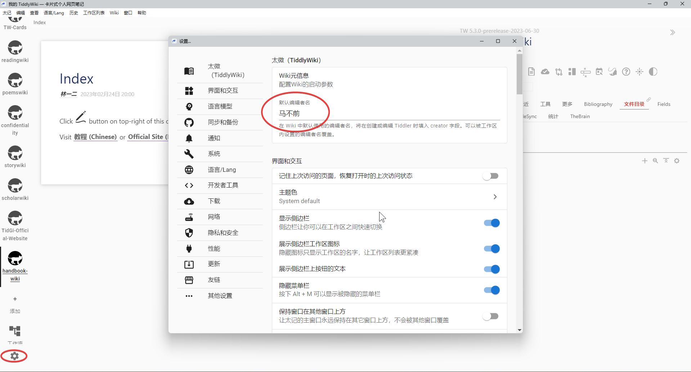

然后我们点击旁边的添加按钮，太记就会弹出窗口。这里我们选择主知识库，暂不改动。下面就是选择文件夹路径和这个 wiki 的名字。

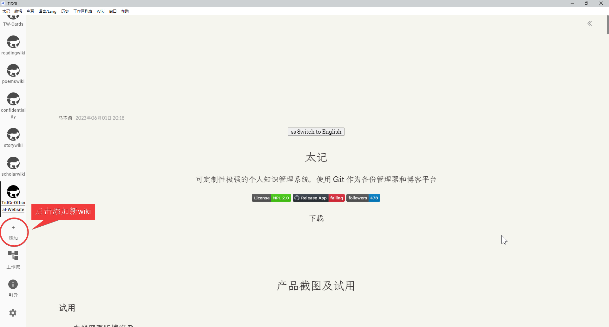

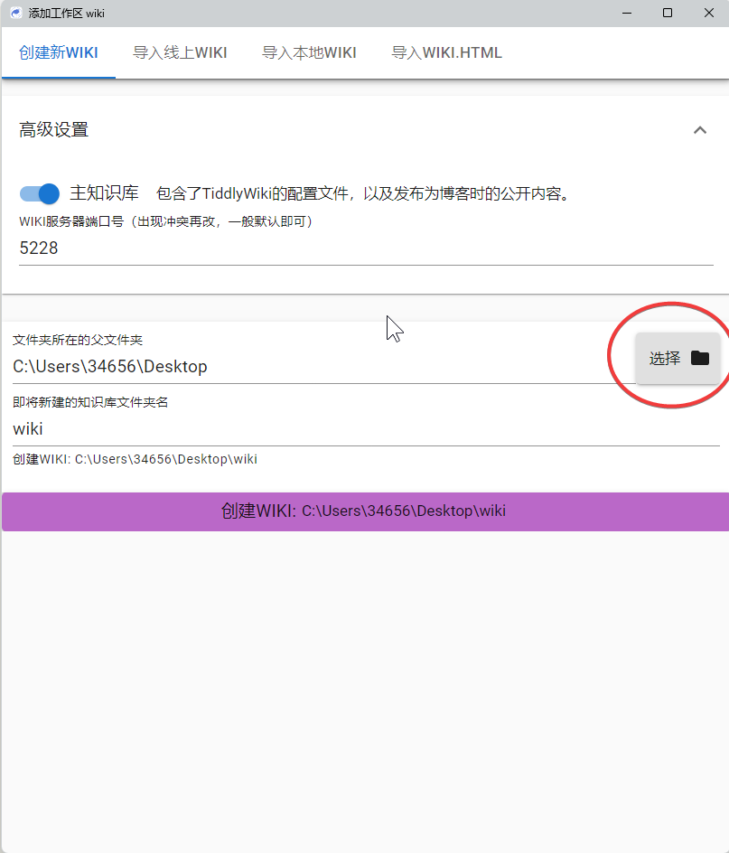

创建成功后就会如下图所示。但下面创建的是旧版默认 wiki，并不是最新版本。最新版本的太记模板我也上传到资料群里了。下载后可以解压出来看到太记文件夹的架构图。并把`Tiddlywiki-NodeJS-Github-Template-master`改成你要设置的 wiki 名字。

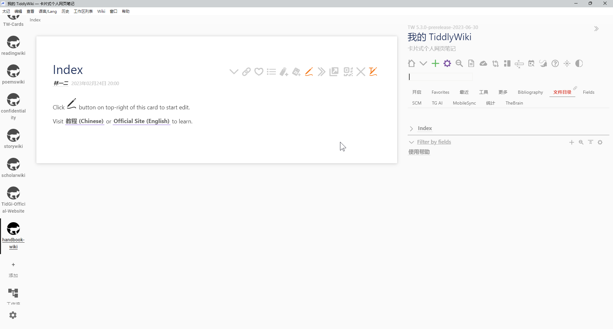

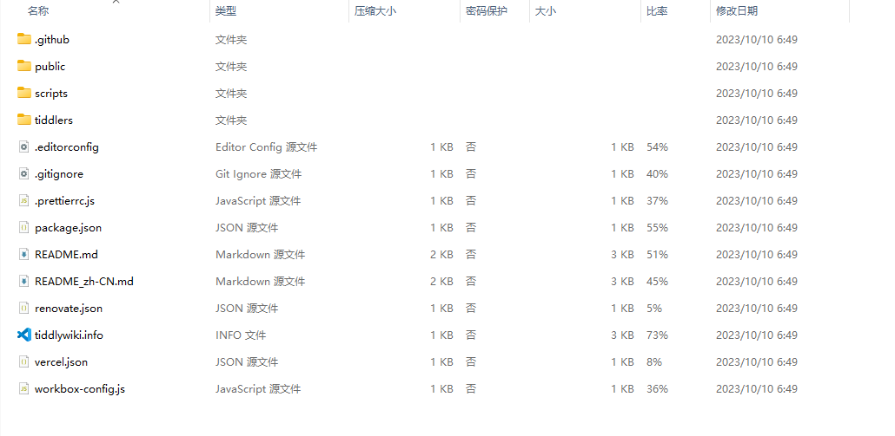

然后把模板里的文件夹放到你要保存的路径中。再点击新建 wiki，选择本地路径文件夹。这样太记就会自动创建 git 了。

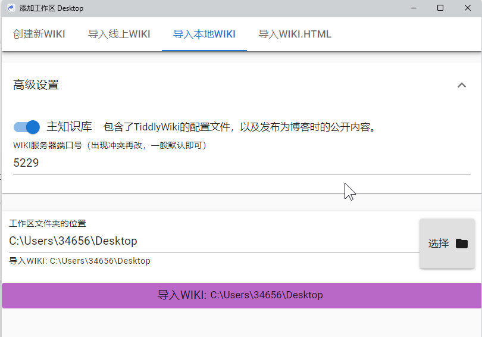

新版本里最明显的变化是两个，一个是条目页面上的按钮变少了，另一个是把钓鱼插件换成了 tidme 插件，两者图标不一样。

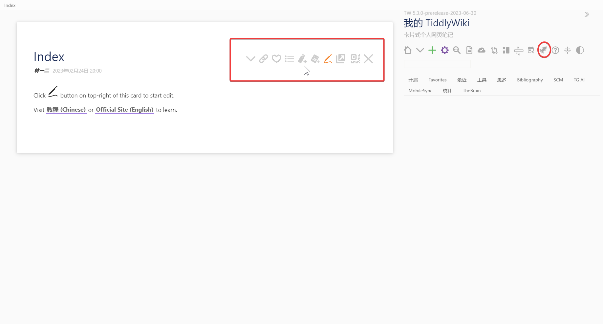

好吧，没有变少。因为里面的 itonnote 插件还没有更新到最新版本，等到写如何更新插件时，就能看到了。

### 太记的优势

之所以推荐太记作为你使用 tiddlywiki 的桌面启动器，有很多原因。

- 太记支持 github 备份，基本上配置好了，后续不需要手动备份
- 太记支持多开 wiki，每个 wiki 都可以有不一样的设置
- 太记开发者在国内，有问题可以提 issue，能及时回复
- 太记使用 nodejs 版本，以更细粒化的形式看到你的笔记
- 太记有专属的安桌程序，可在一定程度上进行多端同步

太记的优势还有很多很多，后面体验到了就能明白。

## Tiddlyhost

- [网址](https://tiddlyhost.com/)

最后一个比较推荐的是 Tiddlyhost。因为只有这个是目前比较好的多端同步解决方案。如果你对多端同步有很强烈的需求的话，那么使用这个比较好。

这个使用 QQ 账号就可以注册登录。唯一的缺点就是可能会受网络影响，而在第一次打开的时候比较慢，打开后就不影响了。

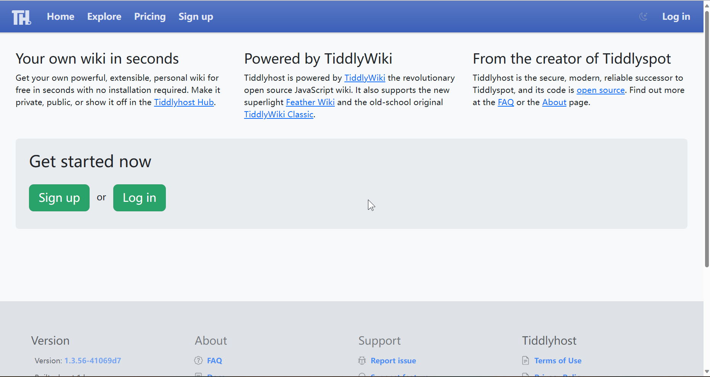

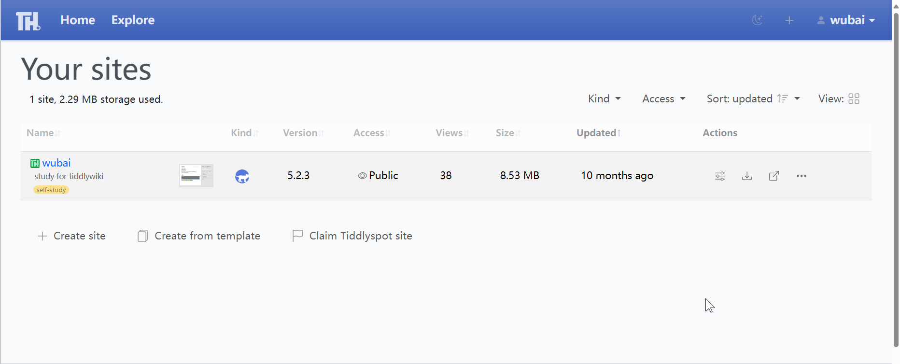

你可以在网络能够访问到这个网址的任何地方，不管是电脑还是平板还是手机，只要浏览器能打开这个网址，你能登录进去，你就可以进行编辑。这个还可以免费把你的 tiddlywiki 发布到网络上。你还可以选择只公开，但不提供下载。同时也可以进行备份，还可以做到使用他人模板，或者自己上传模板，也算是一个资源库。

但我后面基本上切换到太记了，就不再使用了。所以详细内容就留给你自己去探索吧。

这一节到这里就基本上结束了。我也差不多只用过这几种方式，虽然还有自己使用 nodejs 和 timimi，但后面都切换到了太记。如果这些方式都不能实现，那你就再去论坛提问或者搜索其他教程吧。
