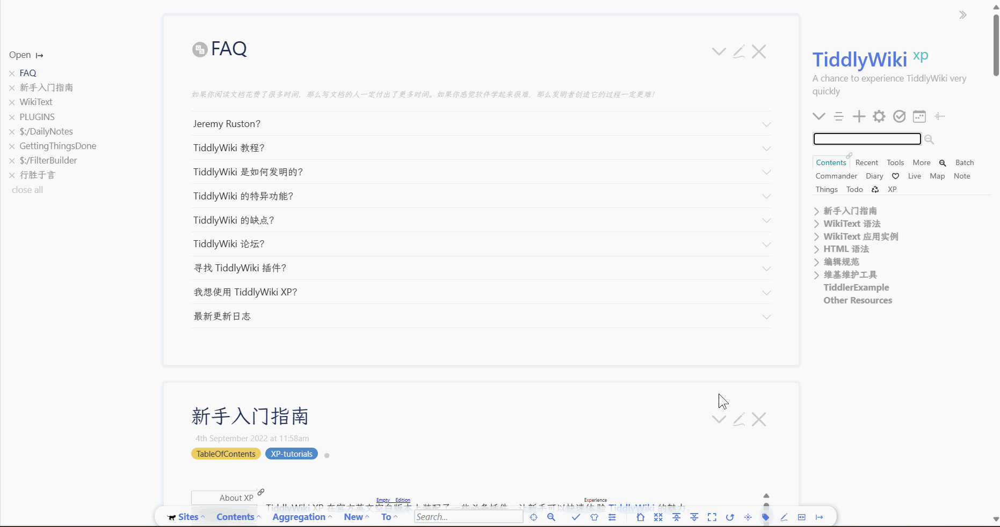
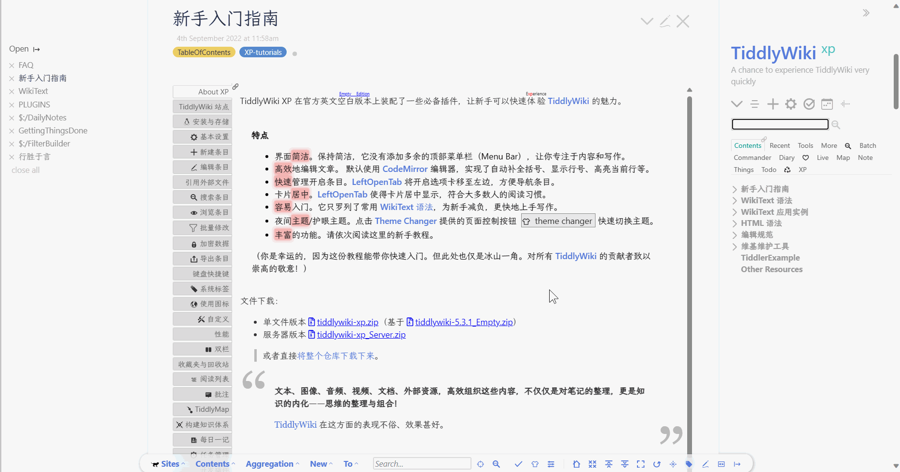
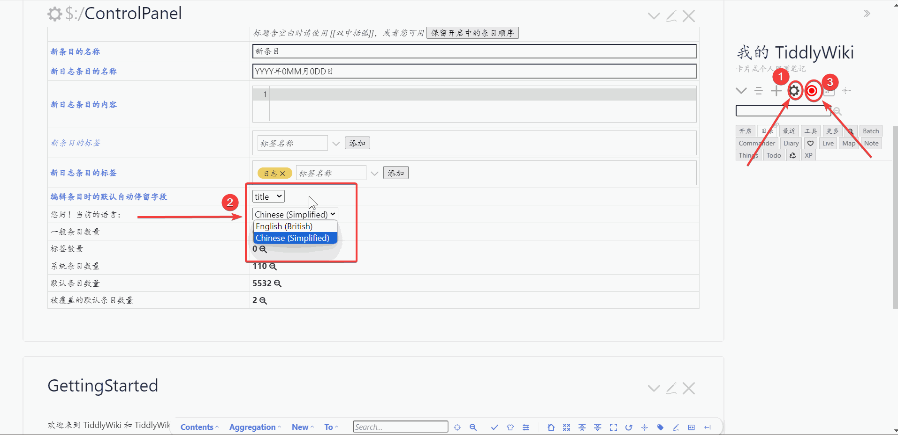
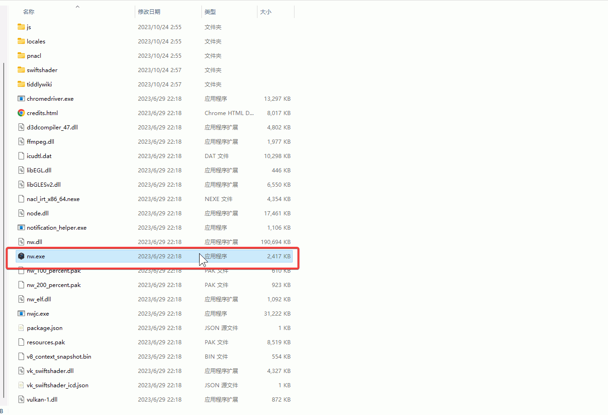

我**不推荐使用太微空白版本**，如果有能力自己从空白版本配置，那大概率也不需要本文档。

## TiddlyWiki XP

- [TiddlyWiki XP](https://keatonlao.github.io/tiddlywiki-xp/)

上面两张图片是 TiddlyWiki XP 网站的封面图，可以看到 TiddlyWiki XP 不止是发行版本，同时也是一份极好地教程。所以我在首页也特地放上了 TiddlyWiki XP 的访问链接，上面也可以看到。这里我把教程和发行版本都放到资料群里，方便下载查看。

解压 `tiddlywiki-xp.zip`文件夹后，发现里面有两个 html 文件，一个是 `tiddlywiki-xp_Full.html`，另一个是 `tiddlywiki-xp_Minimal.html`。前者是 TiddlyWiki XP 的完整发行版本，包含 90 个插件，后者是 TiddlyWiki XP 简约版本，但也足够用户使用，可按需求下载。

### 基本保存与语言设置

但如图所示，封面上全是英文，所以我们需要把语言设置调整为中文。这里 TiddlyWiki XP 已经安装了语言插件，就不演示如何安装，后面会写如何安装插件。下面图片中展示了如何调整语言设置的过程。

首先点击侧边栏里的设置按钮，在展示出来的 `$:/ControlPanel`条目中找到当前语言。然后点击选择，选择简体中文即可。再点击侧边栏中，标红的按钮，点击保存。这样你就得到了修改后的 TiddlyWiki XP 了，并且也学会了**最基本的保存方式**，修改 HTML 文件并点击按钮保存。这里选择后就自动展示为中文了。

## TiddlyDesktop

但如果我们每次都这样，修改后点击保存，是不是太繁琐呢？所以我们现在需要一个桌面启动器，然后帮助我们快速打开并保存备份。

[TiddlyDesktop](https://github.com/TiddlyWiki/TiddlyDesktop) 是由官方开发的桌面启动器。支持所有的桌面平台，是安全绿色的软件。下载地址可以去上面的 github 仓库中，点击 release 下载。这里我也把桌面启动器下载文件放到资料群里。

这里我使用的是 `win11`电脑系统，其他系统不了解。理论上安装不会受影响。这里只演示 windows11 下的操作。我选择的是 `tiddlydesktop-win64-v0.0.18.zip`，解压文件夹，然后双击里面的`nw.js`，如下图所示。

